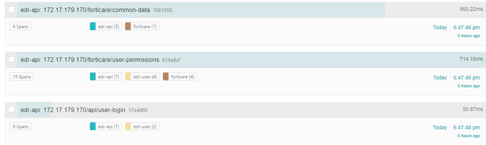
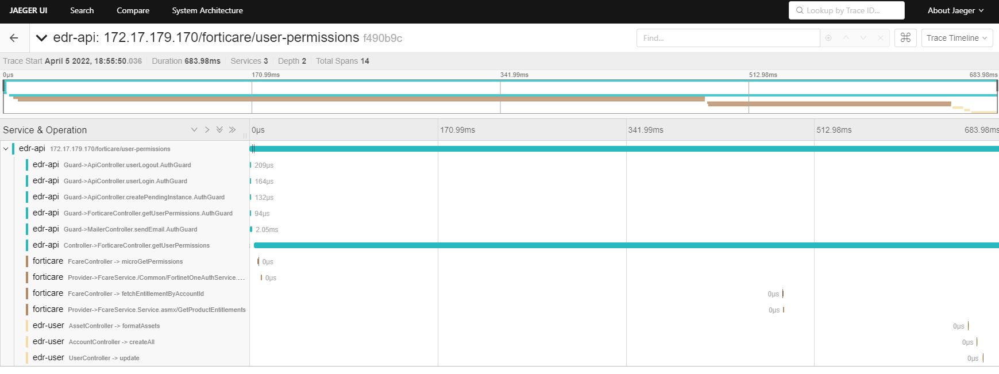

<h1 align="center">NestJS Microservice OpenTelemetry</h1>

This library provides a smimple way to automatically for collecting traces from NestJS applications with Microservice architecture. This library integrated [NestJS Microservice](https://github.com/nestjs/nest/tree/master/packages/microservices), [OpenTelemetry-js](https://github.com/open-telemetry/opentelemetry-js) and Nodejs instrumentations

### Description

Nestjs is a protocol-agnostic framework. That's why this library can able to work with different protocols like TCP,RabbitMQ, GRPC and HTTP. Also you can observe and trace Nestjs specific layers like [Pipe](https://docs.nestjs.com/pipes), [Guard](https://docs.nestjs.com/guards), [Controller](https://docs.nestjs.com/controllers) and [Provider](https://docs.nestjs.com/providers).


- #### Distributed Tracing
  - [Setup](#distributed-tracing-setup)
  - [Trace Interceptor](#trace-interceptor)
  - [Microserve RPC Customized ClientProxy](#microserve-rpc-customized-clientproxy-traceclientproxy)
  - [Trace Decorators](#trace-decorators)
  - [Trace Providers](#trace-providers)

### Installation
``` bash
npm install @/cherie-xf/nestjs-microservice-otel --save
```
***
### Introduce
This is a basic configuration without any trace and metric exporter, but includes default metrics and injectors
```ts
import { OpenTelemetryModule } from '@cherie-xf/nestjs-microservice-otel';

@Module({
  imports: [OpenTelemetryModule.forRoot()]
})
export class AppModule {}
```
#### Default Parameters
| key                 | value                                                                                                                                                                                                                    | description                                                                                                                                                                                                                                                               |
|---------------------|--------------------------------------------------------------------------------------------------------------------------------------------------------------------------------------------------------------------------|---------------------------------------------------------------------------------------------------------------------------------------------------------------------------------------------------------------------------------------------------------------------------|
| spanProcessor       | NoopSpanProcessor                                                                                                                                                                                                        | default spanProcessor inherited from  <a href="https://github.com/open-telemetry/opentelemetry-js/blob/745bd5c34d3961dc73873190adc763747e5e026d/experimental/packages/opentelemetry-sdk-node/src/types.ts#:~:text=NodeSDKConfiguration"> NodeSDKConfiguration </a>        |
| serviceName       | String                                                                                                                                                                                                        | set to resource attribute : SemanticResourceAttributes.SERVICE_NAME        |
| textMapPropagator   | JaegerPropagator, B3Propagator                                                                                                                                                                                           | default textMapPropagator inherited from <a href="https://github.com/open-telemetry/opentelemetry-js/blob/745bd5c34d3961dc73873190adc763747e5e026d/experimental/packages/opentelemetry-sdk-node/src/types.ts#:~:text=NodeSDKConfiguration"> NodeSDKConfiguration </a>     |

`OpenTelemetryModule.forRoot()` takes [OpenTelemetryModuleConfig](https://github.com/MetinSeylan/Nestjs-OpenTelemetry/blob/main/src/OpenTelemetryModuleConfig.ts#L25) as a parameter, this type is inherited by [NodeSDKConfiguration](https://github.com/open-telemetry/opentelemetry-js/blob/745bd5c34d3961dc73873190adc763747e5e026d/experimental/packages/opentelemetry-sdk-node/src/types.ts#:~:text=NodeSDKConfiguration) so you can use same OpenTelemetry SDK parameter.
***
### Distributed Tracing Setup
Simple setup with Jaeger exporter, including with default trace instrumentations.
```ts
import { JaegerExporter } from '@opentelemetry/exporter-jaeger';
import { BatchSpanProcessor } from '@opentelemetry/sdk-trace-base';
import { OpenTelemetryModule } from '@cherie-xf/nestjs-microservice-otel';

@Module({
  imports: [
    OpenTelemetryModule.forRoot({
      spanProcessor: new BatchSpanProcessor(
        new JaegerExporter({
          endpoint: `http://${jaeger.host}:14268/api/traces`,
        }),
      ),
      serviceName: `${myServiceName}`,
    }),
  ],
})
export class AppModule {}
```
After setup, your application will be instrumented, so that you can see almost every layer of application in JeagerUI, including Guards, Pipes, Controllers even global layers like this




List of supported official exporters [here](https://opentelemetry.io/docs/js/exporters/).
***
### Trace Interceptor
This library supports: rename trace span name to meaningful name for both http and rpc; propagation extract parent spanContext of RPC type context

main.ts
```ts
import { TraceInterceptor } from '@cherie-xf/nestjs-microservice-otel';

async function bootstrap() {
  const app = await NestFactory.create(AppModule);

  // set up global interceptor
  app.useGlobalInterceptors(new TraceInterceptor());

  await app.listen(port);
}

bootstrap();

```

api.controller.ts
```ts
import {
  TraceInterceptor,
} from '@cherie-xf/nestjs-microservice-otel';

@Controller('api')
@UseInterceptors(TraceInterceptor)
export class ApiController {
  constructor(
    private readonly apiService: ApiService,
  ) {}
  @Get('get-hello')
  getHello(@Res() res): string {
    return res.status(200).send('Hello World!');
  }
}
```
***
### Microserve RPC Customized ClientProxy: TraceClientProxy
This libary provide customized TraceClientProxy to automatically propagation.inject while making RPC microservice request

```ts
import { Inject, Injectable, Logger } from '@nestjs/common';
import { ClientProxy } from '@nestjs/microservices';
import { TraceClientProxy } from '@cherie-xf/nestjs-microservice-otel';

@Injectable()
export class ApiService {
  private readonly _logger = new Logger(ApiService.name);
  constructor(
    @Inject('USER_CLIENT')
    private readonly user_client: ClientProxy,
    private traceClient: TraceClientProxy,
  ) {}

  async createUser(data: any) {
    const pattern = { name: 'user', cmd: 'create.user' };
    const payload = {
      user_name: data.user_name,
      user_email: data.user_email,
    };
    return await this.traceClient.send(this.user_client, pattern, payload);
  }

```
#### Trace Decorators
This library supports auto instrumentations for Nestjs layers, but sometimes you need to define custom span for specific method blocks like providers methods. In this case `@Span` decorator will help you.
```ts
import { Injectable } from '@nestjs/common';
import { Span } from '@metinseylan/nestjs-opentelemetry';

@Injectable()
export class AppService {
  @Span()
  getHello(): string {
    return 'Hello World!';
  }
}
```
Also `@Span` decorator takes `name` field as a parameter
```ts
@Span('hello')
```
***
#### Trace Providers
You can use Decorators to trace Services, or you can access the native OpenTelemetry Trace api to manually handle span.
```ts
import { Injectable } from '@nestjs/common';
import { Tracer } from '@opentelemetry/sdk-trace-base';

@Injectable()
export class AppService {
  constructor(private readonly tracer: Tracer) {}

  getHello(): string {
    const span = this.tracer.startSpan('important_section_start');
    // do something important
    span.setAttributes({ userId: 1150 });
    span.end();
    return 'Hello World!';
  }
}
```
`TraceService` can access directly current span context and start new span.
```ts
import { Injectable } from '@nestjs/common';
import { TraceService } from '@metinseylan/nestjs-opentelemetry';

@Injectable()
export class AppService {
  constructor(private readonly traceService: TraceService) {}

  getHello(): string {
    const span = this.traceService.startSpan('hello');
    // do something
    span.end();
    return 'Hello World!';
  }
}
```
***
